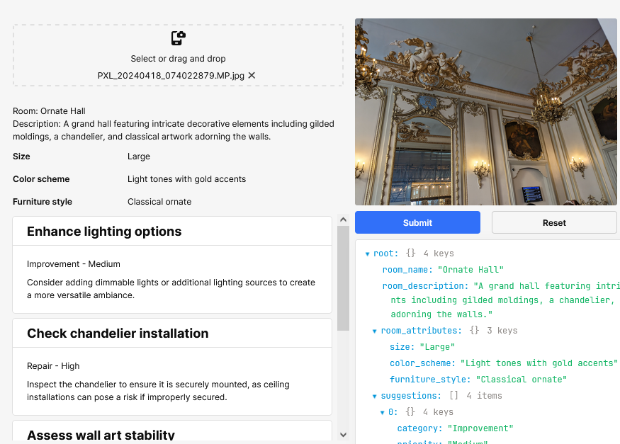

## Introduction

This story starts, like many good ideas, with a bit of curiosity and a product manager messing around with ChatGPT. They decided to see if AI could come up with job recommendations just by feeding it photos of his house. Turns out, it could. And that little experiment set us off on the journey of building _[Home Health](https://homehealth.checkatrade.com/)_—a web app where homeowners upload photos of their homes and get back a detailed report with improvement suggestions.

I was pretty sceptical about using generative AI for something like this. But this project surprised me. It wasn't just about slapping AI onto a problem and hoping for the best—we had to figure out how to make it work, where it fell short, and when to trust it (and when not to). This blog is a look at how we built this thing, the problems we ran into, how I learned to work with AI agents, and why I'm actually proud of how it turned out.

## The Spark: From Idea to Prototype

The whole idea for _Home Health_ came from Jamie, our product manager, who's been at Checkatrade longer than I've had the patience to count and knows how to spot a good opportunity. His goal was simple: inspire homeowners to post more jobs on Checkatrade. More jobs mean more work for our tradespeople. Initially, he thought about adding a blog or a kind of digital magazine to the Checkatrade app—something homeowners could flip through for ideas, like "maybe it's time for that new kitchen" or "I should finally fix that noisy bathroom fan."

But then Jamie, being the curious type, wondered if generative AI could do better. Inspired by recent advancements in ChatGPT, he uploaded photos of his house and asked it to generate a home improvement report. The results were surprisingly good. The AI returned suggestions written in a way that felt like they were tailored for a real homeowner—practical, specific, and, most importantly, inspiring. That's when he looped me in.

At the time, we were just kicking off _Checkatrade Labs_, a small, fast-paced R&D team focused on rapid prototyping and launching experimental projects. This was our first big test. Jamie approached me in late November with a simple request: "Let's launch this before Christmas." That gave me about three weeks—on top of my full-time commitment to another major project called _[Heritage Switch Off](how-we-decommissioned-heritage-without-toppling-the-tower)_. So, with no time during work hours, I rolled up my sleeves and started building in the evenings and weekends.

## Prototyping with Retool

I hadn't built a front-end app in a while, so I reached for something that would let me move fast: [Retool](https://retool.com/). It had just been procured at Checkatrade and was gaining traction internally. I hadn't used it for anything serious before, but it seemed like a good fit for quick prototyping—drag-and-drop components, an embedded database, and, most importantly, built-in AI integration. I figured I could slap together a working prototype in a few days.

And I did. But it wasn't without its headaches.

**The Pros:**

- **Speed:** Retool let me get an internal version of the app up and running quickly.
- **Built-in AI Integration:** I didn't need to mess around with API endpoints—AI tools were already baked in.
- **Ease of Use:** The drag-and-drop interface made it easy to visualize and tweak the UI.

**The Cons:**

- **Performance Issues:** The app slowed down significantly when users uploaded high-quality images. Retool stores images in the browser as base64, and once you hit 10+ photos, things got sluggish fast.
- **File Upload Limitations:** The default file upload component didn't support mobile camera input, which was a problem.
- **AI Response Formatting:** Retool didn't support OpenAI's JSON response format natively, so I had to craft prompts carefully and write functions to strip out non-JSON text.
- **Slow Workflows:** The AI-generated reports took over two minutes to process, causing timeouts and failed generations. I had to add a retry button to handle these issues.

Despite the challenges, we released the prototype internally before Christmas. It wasn't perfect, but it worked. And more importantly, it proved the concept. People at Checkatrade loved it, sharing their reports and comparing home scores like it was a game.

## Transitioning to a Full-Fledged Web App

Once the internal prototype was a hit, it was clear we needed to rebuild it for public release. Retool was great for prototyping, but it wasn't reliable or performant enough for a wider audience.

Here's the thing: I hadn't built a proper web app in years. But instead of spending weeks refreshing my React skills, I let AI do the heavy lifting. I used [Anthropic's Claude](https://www.anthropic.com/claude) through a VS Code extension called [Cline](https://github.com/cline/cline) to bootstrap the project. I gave it a simple prompt: "Build me a web app like this Retool prototype." And it did.

**The Stack:**

- **React with Tailwind CSS:** Clean, responsive UI.
- **Next.js:** For easy routing and server-side rendering.
- **shadcn UI components:** Polished, pre-built components that made everything look professional without much effort.

I was skeptical about going with the typical React/Next.js stack—I usually like finding simpler, less mainstream solutions. But the AI agents knew this stack inside out, and the wealth of online resources made troubleshooting a breeze. Plus, I wasn't flying blind. The Retool prototype served as a template, so the AI agents could recreate the app in Next.js without starting from scratch.

Deploying was straightforward. I set up a GitHub repo, added GitHub Actions for CI/CD, and deployed to Google App Engine (though in hindsight, I might have preferred Cloud Run). The whole process was smooth, and the performance boost compared to Retool was night and day.

## Integrating Generative AI for Image Recognition

Getting the AI to analyse photos and generate useful recommendations was a challenge. Early on, we tried stuffing too much into a single prompt—asking the AI to describe the room, identify issues, suggest improvements, recommend trades, and estimate costs all at once. The results were… not great. The AI would often default to examples from the prompt, especially when the photo lacked clear information (like a black image).

**The Solution:** I broke the process into multiple steps:

1. **Room Identification:** "What room is this? Describe it."
2. **Issue Detection:** "What home improvement issues can you spot in this photo?"
3. **Job Formatting:** Turn the identified issues into job recommendations.
4. **Trade Categorization:** Match each job with the appropriate trade category.

Splitting the tasks made the AI's job easier and improved accuracy. It also let us use lighter, cheaper models like [GPT-4o Mini](https://openai.com/index/gpt-4o-mini-advancing-cost-efficient-intelligence/), which cut down costs and sped up processing.

I did, at one point, pitch the idea of building our own computer vision model—one trained specifically on home improvement issues. Imagine an AI that could tell if your boiler's outdated or if there's damp in your ceiling. But time and budget constraints made that a "maybe someday" idea. For now, the generative AI solution works well enough, especially for a free tool.

Interestingly, the most expensive part of the project wasn't the AI. It was the address lookup feature. We needed Unique Property Reference Numbers (UPRNs) to pull data from Chimney, a third-party service that provides detailed property information (build year, roof type, property value, etc.). Standard services like Google Autocomplete didn't provide UPRNs, so we used [Ideal Postcodes](https://ideal-postcodes.co.uk/), which charges up to 15 pence per query for comprehensive data—the biggest cost in the project.

## Launching Home Health and Gathering Feedback

We're publicly rolling out _Home Health_ gradually through email campaigns in small batches. It's currently still in its gradual rollout phase.

Internally at Checkatrade, it's been a hit. People love comparing their home scores (we included a fun, credit-score-like rating in the report), and it's sparked a lot of engagement. We're excited to see how the public reacts as we continue the rollout.

## Lessons Learned and Future Directions

The biggest lesson? AI agents can build a web app faster than I expected—especially when they're working within familiar frameworks. If I could do it over, I'd skip Retool and go straight to Next.js. Not because Retool was bad, but because the AI tools I used made building a full-fledged app just as fast (and far more performant).

I learned a lot about working with AI agents. Using Cline in VS Code, I supervised every change, giving real-time feedback. It felt like pair programming, but with an AI. I also experimented with Devin, a cloud-hosted AI agent that worked independently. While having multiple agents running in parallel sounded great, reviewing their pull requests was a nightmare—they'd often drift from the original task, and understanding their logic after the fact was time-consuming. I'm curious to explore multi-agent systems further, maybe even building my own with distinct roles (developer, project manager, QA tester) to keep things on track.

As for _Home Health_, the next logical step is developing a custom computer vision model. The current AI setup works, but I'd love to see it get better at recognizing specific home issues—things like cracks in tiles, outdated boilers, or subtle signs of damp. But for now, I'm proud of where the app stands.

## Advice for Aspiring AI-Driven Web App Builders

The best thing we did was validate the concept early. Jamie didn't wait for a fancy tool or a big team—he just used ChatGPT to see if the idea had legs. And that's my advice to anyone looking to build with AI: just use it. Don't overthink it. Experiment, break things, see what works. Generative AI isn't some mysterious black box—it's a tool. And the best way to understand what it can do is to put it to work.

## Conclusion

_Home Health_ started as an experiment and turned into something I'm genuinely proud of. It's not perfect (and I'll always have ideas for making it better), but seeing it go from Jamie's ChatGPT test to a live app people are using is pretty rewarding. The biggest thing I've learned? AI is a lot more useful when you stop theorizing about what it _might_ do and actually put it to work. Sure, it's not always right, and it'll happily hallucinate its way through a prompt if you let it—but with the right setup, it can speed things up in ways I didn't expect.

For anyone thinking about building AI-driven apps, my advice is simple: just start. Experiment, validate your ideas with accessible tools, and don't be afraid to let AI help you learn and build. This project taught me that you don't need some grand plan or perfect process—you just need to start. And who knows? You might end up building something cool along the way.

You can use Home Health right now at [homehealth.checkatrade.com](https://homehealth.checkatrade.com/)

If you've got thoughts, questions, or just want to compare home scores, drop me a line. I'm always up for a chat about this stuff.
